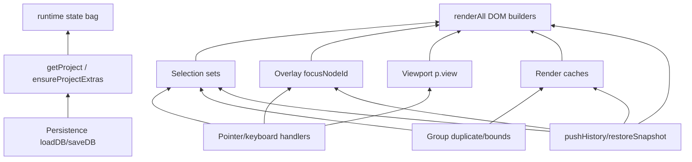

# Runtime dependency graph

## Layer diagram

## Dangerous mutation zones

| Zone | Functions | Touches |
|------|-----------|---------|
| **H1** | `restoreSnapshot` | overlay, all selection, caches, full render |
| **H2** | `renderAll` | entire canvas + inspector sync |
| **H3** | `duplicateUserGroup` | project, selection, caches, render |
| **H4** | `sanitizeSelectionState` | selection + overlay guard |
| **H5** | `openFocusModal` / `closeFocusModal` | overlay + inspector fields |

## Coupling edges (must use adapters)

- `sanitizeSelectionState` → `overlayRuntime.syncFocusModalOrphanGuard`
- `restoreSnapshot` → `overlayRuntime.teardownFocusModalUi` + `selectionRuntime.clearAll`
- `duplicateUserGroup` → `renderRuntime.invalidate` + `selectionRuntime` set group

## Cycles to avoid

- overlay → renderAll → sanitize → overlay (guard prevents orphan only)
- selection module must not import render module; use `emit('selectionChanged')`

## Extraction order (dependency-safe)

1. Overlay (fewest upstream deps if deps injected)
2. Selection (emit to render)
3. Viewport (mostly `p.view`)
4. Render caches (used by group/selection)
5. Group (depends on render invalidate + selection)
6. Command (wraps group + pushHistory)
