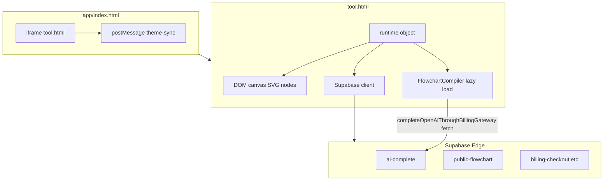

# Phase 1 — Infrastructure & Repository Mapping Audit

**Scope:** `app/`, `src/flowchart/`, `tests/flowchart/`, `vite*.config.ts`, `package.json`, `supabase/functions/`, `supabase/migrations/`  
**Evidence date:** 2026-05-16  
**Prior report:** [`reports/audit-phase-1.md`](../../audit-phase-1.md) covers sitewide marketing/static HTML only (explicitly excluded `tool.html`). This document does **not** repeat those marketing findings.

---

## 1. Directory trees (scoped paths)

### `app/`

```
app/
├── architecture-engine.js       # Vite lib build output (architecture-entry.ts)
├── architecture-engine.js.map   # Source map (not enumerated if gitignored elsewhere)
├── flowchart-compiler.js          # Vite lib build output (src/flowchart/index.ts)
├── flowchart-compiler.js.map
├── index.html                     # Shell: iframe → tool.html + theme sync
├── tool.html                      # Primary editor monolith
└── view.html                      # Public/share viewer shell
```

### `src/flowchart/`

```
src/flowchart/
├── flowchart-beautify.ts
├── flowchart-compile.ts
├── flowchart-export-spec.ts
├── flowchart-label.ts
├── flowchart-layout.ts
├── flowchart-normalize.ts
├── flowchart-prompts.ts
├── flowchart-quality.ts
├── flowchart-retry.ts
├── flowchart-reveal.ts
├── flowchart-spec.ts
└── index.ts                       # Bundle entry → window.FlowchartCompiler
```

### `tests/flowchart/`

```
tests/flowchart/
├── compiler.test.ts
└── fixtures/
    ├── approval-flow.json
    ├── bug-triage.json
    ├── customer-escalation.json
    ├── deep-branch-tree.json
    ├── linear-onboarding.json
    ├── merge-heavy.json
    ├── multi-branch.json
    ├── qa-retry-flow.json
    └── support-escalation.json
```

### `supabase/functions/`

```
supabase/functions/
├── admin-billing/index.ts
├── ai-complete/index.ts
├── billing-checkout/index.ts
├── billing-mock-purchase/index.ts
├── public-flowchart/index.ts
└── stripe-webhook/index.ts
```

### `supabase/migrations/`

```
supabase/migrations/
├── 20260209120000_ai_credit_billing.sql
├── 20260210120000_rpc_ai_reserve_nonpositive_balance.sql
├── 20260211120000_cap_rpc_add_credits_amount.sql
└── 20260515120000_public_flowcharts.sql
```

---

## 2. Entry points

| Entry | Path | Role |
|-------|------|------|
| App shell | [`app/index.html`](../../../app/index.html) | Loads editor in iframe `src="/app/tool.html"`; `postMessage` theme sync to iframe |
| Editor | [`app/tool.html`](../../../app/tool.html) | Full diagram editor + auth + persistence + flowchart UX |
| Viewer | [`app/view.html`](../../../app/view.html) | Shared/public flowchart viewing (`noindex` default meta) |
| Flowchart compiler bundle | [`app/flowchart-compiler.js`](../../../app/flowchart-compiler.js) | Built from [`src/flowchart/index.ts`](../../../src/flowchart/index.ts); exposes `window.FlowchartCompiler` |
| Architecture bundle | [`app/architecture-engine.js`](../../../app/architecture-engine.js) | Built from [`src/architecture-entry.ts`](../../../src/architecture-entry.ts); exposes `window.ArchitectureEngine` |

---

## 3. Build outputs vs sources

| Output | Producer | Config |
|--------|----------|--------|
| `app/flowchart-compiler.js` (+ `.map`) | `vite build --config vite.flowchart.config.ts` | [`vite.flowchart.config.ts`](../../../vite.flowchart.config.ts): `outDir: "app"`, **`emptyOutDir: false`** |
| `app/architecture-engine.js` (+ `.map`) | `vite build --config vite.architecture.config.ts` | [`vite.architecture.config.ts`](../../../vite.architecture.config.ts): same pattern |

**Risk note:** `emptyOutDir: false` means builds **do not wipe** `app/`; stale artifacts are possible if entry/output names change.

---

## 4. Compiler vs runtime boundaries

| Boundary | Evidence |
|----------|----------|
| **Spec validation / layout** | TS modules under `src/flowchart/*` |
| **Runtime consumption** | `tool.html` loads compiler via dynamic script loader (`loadFlowchartCompilerScript`, ~L7110+) and uses `window.FlowchartCompiler` (~L7153, L7219, L12650) |
| **AI / billing coupling in bundle** | [`src/flowchart/index.ts`](../../../src/flowchart/index.ts) exports `completeOpenAiThroughBillingGateway` from [`src/ai-service.ts`](../../../src/ai-service.ts) — compiler **browser bundle** includes Edge fetch client |

---

## 5. Network boundaries (initial map)

| Surface | Location | Notes |
|---------|----------|-------|
| Supabase JS client | `tool.html` loads CDN UMD `@supabase/supabase-js@2.49.1` (~L3828) | Version pinned in HTML |
| Project URL / anon key | [`assets/supabase-config.js`](../../../assets/supabase-config.js) (referenced ~L3826); example in [`assets/supabase-config.example.js`](../../../assets/supabase-config.example.js) | Actual secrets **not** verified in audit (may be gitignored) |
| Edge Functions invoked from editor | `runtime.supabase.functions.invoke("billing-checkout" \| "billing-mock-purchase")` (~L5340–L5357) | Count: **2** `functions.invoke` sites in `tool.html` |
| AI completion | [`src/ai-service.ts`](../../../src/ai-service.ts) → `POST ${base}/functions/v1/ai-complete` | Used by bundled compiler export |
| Public publish/read | [`supabase/functions/public-flowchart/index.ts`](../../../supabase/functions/public-flowchart/index.ts) | Separate Edge surface |

---

## 6. Iframe boundaries

| Finding | Severity | Confidence | Location | Evidence | Why it matters |
|---------|----------|------------|----------|----------|----------------|
| Parent uses wildcard `postMessage` target | **High** | High | [`app/index.html`](../../../app/index.html) L34–36 | `fr.contentWindow.postMessage({ type: "mapdiagram-theme-sync", mode: m }, "*");` | Any origin embedding could theoretically receive mis-targeted messages if iframe navigated; paired with missing origin check on receive in shell (L38–41 filters by `type`/`source` only) |
| Editor does **not** contain `postMessage` / `theme-sync` string matches | **Low** (informational) | High | `tool.html` | `rg postMessage|theme-sync` → no hits | Theme bridge likely via [`assets/theme-engine.js`](../../../assets/theme-engine.js) + `mapdiagram-theme-change` event (`tool.html` ~L12808+) |

---

## 7. Module inventory

| Module | Responsibility | Depends on | Risk |
|--------|----------------|------------|------|
| `tool.html` | UI, state, canvas, auth, persistence, flowchart product | DOM, Supabase UMD, shared scripts, optional `flowchart-compiler.js` | **Critical** concentration |
| `src/flowchart/*` | Spec validation, layout, compile to canvas payload | `dagre`, `src/ai-service` (via index) | Medium (tested); AI coupling raises bundle sensitivity |
| `supabase/functions/*` | Billing, AI gateway, public flowcharts, Stripe | Deno, Supabase service role, env secrets | High if misconfigured |
| `tests/flowchart/compiler.test.ts` | Compiler regression | Vitest, Node `fs`/`path` | TS `tsc` gap (see build report) |

---

## 8. Dependency map (package-level)

```
package.json
├── dependencies: dagre
├── devDependencies: typescript, vite, vitest, @types/dagre
└── scripts: build:flowchart | build:arch | build:compilers | test:flowchart | test

vite.flowchart.config.ts → bundles src/flowchart/index.ts (+ transitive modules including ai-service)
vite.architecture.config.ts → bundles src/architecture-entry.ts → architecture-spec (+ ai paths per entry re-exports)
```

---

## 9. Runtime flow (summary)



---

## 10. Reference to earlier audit

**Do not duplicate:** Sitewide SEO/GA/nav duplication findings live in [`reports/audit-phase-1.md`](../../audit-phase-1.md). This phase-1 infra audit focuses on **editor/compiler/supabase** as requested.
