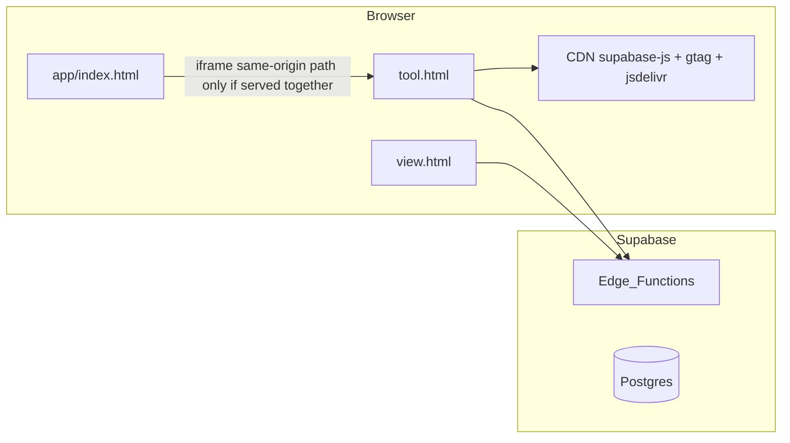

# Phase 1 — Initial Security Surface Discovery

**Scope:** Threat mapping only — **no** penetration test, **no** secret scanning of ignored files.

---

## 1. Trust boundaries

---

## 2. Initial threat surface table

| ID | Finding | Severity | Confidence | Path | Evidence | Why it matters | Phase-2 action |
|----|---------|----------|------------|------|----------|----------------|----------------|
| T1 | Parent `postMessage` uses wildcard target `"*"` | **High** | High | [`app/index.html`](../../../app/index.html) L34–36 | `postMessage({ type: "mapdiagram-theme-sync", mode: m }, "*");` | Raises importance of iframe URL integrity & CSP | Validate origin + exact targetOrigin |
| T2 | Shell message handler filters type string only | **Medium** | High | [`app/index.html`](../../../app/index.html) L38–41 | `if (!e.data || e.data.type !== "mapdiagram-theme"...` no `e.origin` check | Cross-origin frames posting crafted objects — limited harm but increases UI confusion risk | Add origin allowlist |
| T3 | Edge CORS `Access-Control-Allow-Origin: *` | **Medium** | High | [`supabase/functions/ai-complete/index.ts`](../../../supabase/functions/ai-complete/index.ts) L10–14; [`public-flowchart/index.ts`](../../../supabase/functions/public-flowchart/index.ts) L8–11 | Static cors headers | Normal for Supabase Edge but relies on JWT/apikey correctness | Review auth on sensitive endpoints |
| T4 | AI gateway logs structured metadata incl. token lengths | **Medium** | High | [`src/ai-service.ts`](../../../src/ai-service.ts) L56–64 | `edgeLog("POST fetch ai-complete", { ... accessTokenLen ... })` | Reduces accidental full-token logs but still leaks ops signals | Ensure prod log sink policy |
| T5 | Client-side anon key presence pattern | **High** | Medium | [`assets/supabase-config.example.js`](../../../assets/supabase-config.example.js) | `window.MAPDIAGRAM_SUPABASE_ANON_KEY` | Expected for Supabase; abuse relies on RLS | Verify RLS + Edge auth depth |
| T6 | Dynamic HTML insertion hotspots | **Medium** | Medium | `tool.html` | `innerHTML`/`insertAdjacentHTML` count **31** | XSS if any path feeds unsanitized strings | Trace user HTML paths |
| T7 | Third-party script inclusion in editor | **Medium** | High | `tool.html` ~L3828 | `@supabase/supabase-js` from jsDelivr CDN | Supply-chain / integrity | Consider self-host + SRI |
| T8 | Google Analytics in editor page head | **Low** | High | `tool.html` ~L7–8 | gtag loader | Privacy / CSP surface | Document policy |

---

## 3. Storage surfaces (initial)

| API | Count in `tool.html` | Example evidence |
|-----|---------------------|------------------|
| `localStorage` / `sessionStorage` | **35** combined | Theme persistence ~L12888 |

**Not verified:** Keys beyond theme — Phase 2 exhaustive enumeration.

---

## 4. Supabase integration points (editor)

| Mechanism | Evidence |
|-----------|----------|
| CDN UMD client | `tool.html` ~L3828 |
| Functions invoke | `billing-checkout`, `billing-mock-purchase` ~L5340–L5357 |
| AI fetch via bundled compiler | [`src/ai-service.ts`](../../../src/ai-service.ts) fetch `functions/v1/ai-complete` |

---

## 5. Public share surface

**File:** [`supabase/functions/public-flowchart/index.ts`](../../../supabase/functions/public-flowchart/index.ts)

| Control | Evidence |
|---------|----------|
| Payload caps | `MAX_NODES`, `MAX_EDGES`, `MAX_JSON_BYTES` L13–15 |
| Anonymous GET | Comment L4 |

**Severity:** **Medium** pending Phase 2 review of slug enumeration + rate limits.

---

## 6. Areas requiring deeper Phase-2 audit

1. Full **`bootstrapAuth` / session refresh`** flow in `tool.html`.  
2. **Publish pipeline** — what data leaves browser vs stays server-side.  
3. **RLS policies** on tables touched by migrations (read SQL).  
4. **Content Security Policy** headers at CDN/host — **Not verified** (deployment external).  
5. **`share-dock.js`** + `/shared/share-dock.js` behavior.

---

## 7. Explicit non-findings / not verified

| Topic | Status |
|-------|--------|
| Live JWT leakage in logs | **Not verified** |
| `supabase-config.js` committed secrets | **Not verified** (may be gitignored) |
| Rate limiting on Edge beyond env knobs | Partially visible in `ai-complete` — full review deferred |
