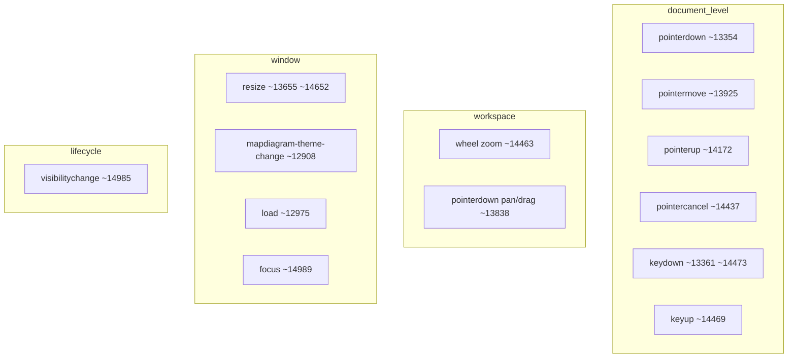

# Phase 2 — Event System Report

**Target:** [`app/tool.html`](../../../app/tool.html)

---

## 1. Event topology map



---

## 2. Listener hotspot table

| Target | Event | Approx line | Role | Severity |
|--------|-------|-------------|------|----------|
| `document` | `pointermove` | ~13925 | Pan, drag, marquee, connect preview, pinch — **mega-handler** | **Critical** |
| `document` | `pointerup` | ~14172 | Finalize drags, connections, marquee | High |
| `document` | `pointerdown` | ~13354 | Global delegation / shortcuts | High |
| `workspace` | `pointerdown` | ~13838+ | Canvas interaction entry | High |
| `workspace` | `wheel` | ~14463 | Zoom (`passive: false`) | Medium |
| `window` | `resize` | ~13655, ~14652 | **Duplicate handlers** | Medium |
| Per-connection SVG `hit` | `pointerdown` | Many (~10083+) | Edge picking — created each `renderConnections` | Medium |
| Per-node `body` | `pointerdown` / `dblclick` | ~9877+ | Node edit/drag | Medium |

**Evidence — wheel zoom:**

```14463:14467:c:\mapdiagram\app\tool.html
  workspace.addEventListener("wheel", (e) => {
    e.preventDefault();
    const step = e.deltaY > 0 ? -0.08 : 0.08;
    zoomAt(e.clientX, e.clientY, getProject().view.zoom + step);
  }, { passive: false });
```

---

## 3. Listener leak analysis

| Finding | Severity | Confidence | Evidence | Runtime impact |
|---------|----------|------------|----------|----------------|
| `removeEventListener` essentially unused | **High** | High | Only **2** `removeEventListener` hits (~6334 inline rename, ~7036) | Global listeners live for document lifetime — acceptable for SPA shell but prevents teardown patterns |
| Flow group / toolbar binds use `dataset.fcFgBound` guards | Low | High | Pattern ~5919 | Prevents duplicate binding on overlay refresh |
| Connection listeners recreated every `renderConnections` | Medium | High | Full SVG rebuild ~10017–10018 | Not a leak if old DOM detached — CPU churn |

---

## 4. Duplicate / cascading handlers

| Finding | Severity | Confidence | Evidence | Runtime impact |
|---------|----------|------------|----------|----------------|
| Two `window.addEventListener("resize"` registrations | **Medium** | High | ~13655 and ~14652 | Same burst fires twice → redundant minimap/layout work |
| Two `document.addEventListener("keydown"` registrations | **Low** | High | ~13361 (topbar Escape-only) vs ~14473 (global editor shortcuts) | Different guards — low conflict but ordering-sensitive if expanded |

---

## 5. Re-entrancy / propagation

| Finding | Severity | Confidence | Evidence | Runtime impact |
|---------|----------|------------|----------|----------------|
| Flowchart toolbars use capture-phase shield `stopPropagation` | Medium | High | ~6273–6276, ~6477 | Blocks workspace `pointerdown` — intentional but brittle ordering |
| `e.stopPropagation()` on connections | Medium | High | e.g. ~10083–10086 | Prevents canvas clear — correct layering assumption |

---

## 6. Input latency risk areas

| Area | Severity | Reason |
|------|----------|--------|
| Single `pointermove` pipeline | **High** | Handles marquee + pan + drag + connection preview + pinch — **serial** execution per event |
| `renderConnections()` full SVG rebuild after resize | **High** | ResizeObserver path ~4277–4278 |
| `zoomAt` → `markDirty` every wheel tick | Medium | ~12146–12158 — triggers debounced work each zoom step |

---

## 7. Potential leak locations

| Location | Risk | Confidence |
|----------|------|------------|
| Auth `onAuthStateChange` subscription | Medium | Supabase client typically persists — verify unsubscribe **Not verified** |
| `setTimeout` chains in interaction (`clearFcInteractionState`) | Low | Uses bounded timeouts (~130ms preview removal) |

---

## 8. Remediation priorities

1. Merge duplicate `resize` handlers into one guarded RAF debounce.  
2. Split `pointermove` into phased handlers or early-return guards by interaction mode (instrument first).
