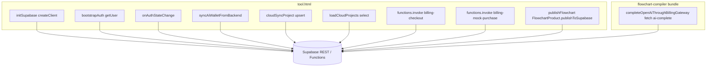

# Phase 2 — Network Runtime Report

**Target:** [`app/tool.html`](../../../app/tool.html) + referenced modules

---

## 1. Network call graph



---

## 2. Supabase interaction map

| Operation | Function | Approx lines | Auth expectation | Retry / cancel |
|-----------|----------|--------------|------------------|----------------|
| Client init | `initSupabase` | ~5078–5119 | N/A | N/A |
| Session bootstrap | `bootstrapAuth` | ~5455–5478 | Uses `getUser` | **None** |
| Auth listener | `onAuthStateChange` | ~5465–5477 | Session swap | **None** |
| Wallet read | `syncAiWalletFromBackend` | ~5277–5295 | Requires user | Sets null on error |
| Cloud pull | `loadCloudProjects` | ~5380–5415 | Requires user | **None** |
| Cloud push | `cloudSyncProject` | ~5417–5443 | Requires user | Error → indicator text |
| Debounced sync | `scheduleCloudSync` | ~5445–5453 | Requires user | **600ms debounce only** |
| Checkout | `billing-checkout` invoke | ~5340–5342 | JWT via client | **None** |
| Mock credits | `billing-mock-purchase` | ~5355–5357 | JWT | **None** |
| Publish | `publishFlowchart` | ~12685–12724 | JWT | try/finally clears UI flag |

---

## 3. Evidence snippets

### Wallet fetch

```5277:5294:c:\mapdiagram\app\tool.html
  async function syncAiWalletFromBackend() {
    if (!runtime.supabase || !runtime.authUser) {
      runtime.aiCredits = null;
      applyAiCreditGatesToUi();
      return;
    }
    const { data, error } = await runtime.supabase
      .from("user_wallets")
      .select("credits")
      .eq("user_id", runtime.authUser.id)
      .maybeSingle();
```

### Cloud upsert payload

```5417:5434:c:\mapdiagram\app\tool.html
  async function cloudSyncProject(project) {
    ...
    const payload = {
      id: project.projectId,
      user_id: runtime.authUser.id,
      name: project.name,
      data: {
        title: project.title,
        nodes: project.nodes,
        connections: project.connections,
        userGroups: project.userGroups || [],
        groupConnections: project.groupConnections || [],
        flowGroups: project.flowGroups || [],
        view: project.view
      },
```

### Auth logging (information leakage risk)

```5460:5466:c:\mapdiagram\app\tool.html
    const { data } = await runtime.supabase.auth.getUser();
    console.log("[App Auth] bootstrap getUser:", data);
```

### Publish + clipboard

```12700:12716:c:\mapdiagram\app\tool.html
      const snap = FlowchartProduct.buildSnapshot({
        getProject,
        deepCopy,
        getEditCount: getFcEditCount,
      });
      const result = await FlowchartProduct.publishToSupabase(
        {
          supabase: runtime.supabase,
          supabaseUrl: SUPABASE_URL,
          supabaseAnonKey: SUPABASE_ANON_KEY,
          normalizeSupabaseProjectUrl,
        },
        { title: snap.title, data: snap },
      );
      const url = result.url || (location.origin + "/app/view.html?slug=" + result.slug);
      await navigator.clipboard.writeText(url);
```

---

## 4. Async collision matrix

| Collision | Severity | Confidence | Scenario | Gap |
|-----------|----------|------------|----------|-----|
| `scheduleCloudSync` overlapping calls | Low | Medium | Debounced single timer | Slow network could backlog — **Not verified** |
| `loadCloudProjects` vs pending autosave | **High** | Medium | User logs in while dirty timer fires | No mutex |
| Parallel `syncAiWalletFromBackend` | Medium | Medium | focus + visibilitychange both fire ~14987–14990 | Concurrent selects — eventual consistency |
| Auth sign-out during `cloudSyncProject` | Medium | Low | **Not verified** | Needs staged abort |

---

## 5. Failure recovery gaps

| Gap | Severity | Evidence |
|-----|----------|----------|
| No retry on `cloudSyncProject` error | Medium | ~5435–5438 sets indicator only |
| No offline queue | Medium | Implicit single-device expectation |
| Publish failure surfaces toast only | Low | ~12720–12721 |

---

## 6. Trust assumptions

| Assumption | Severity | Notes |
|------------|----------|-------|
| Supabase anon key public | Expected | RLS must enforce |
| `FlowchartProduct.publishToSupabase` validates snapshot server-side | **High** | Depends on Edge — align with [`public-flowchart`](../../../supabase/functions/public-flowchart/index.ts) Phase 1 |

---

## 7. fetch usage

Direct `fetch(` in `tool.html`: **Not found** in Phase 2 grep — networking goes through Supabase SDK + external [`src/ai-service.ts`](../../../src/ai-service.ts) inside compiler bundle.

---

## 8. Remediation priorities

1. Serialize cloud sync with revision counter or `AbortController`.  
2. Remove / gate verbose auth `console.log` in production builds.  
3. Add structured logging + retry policy for failed upserts.
