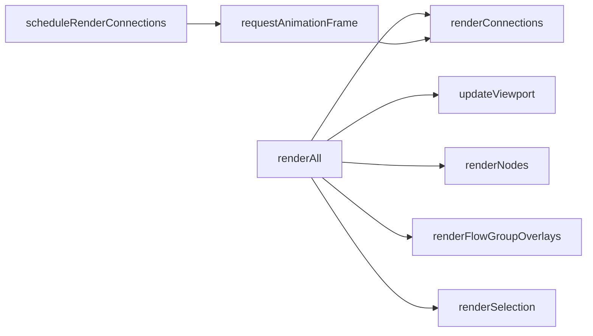

# Phase 2 — Rendering Pipeline Report

**Target:** [`app/tool.html`](../../../app/tool.html)

---

## 1. Rendering pipeline diagram



---

## 2. Core mechanics

### `renderAll`

```12045:12063:c:\mapdiagram\app\tool.html
  function renderAll() {
    ensureProjectExtras(getProject());
    updateViewport();
    if (nodePicker && !nodePicker.children.length) renderNodePicker();
    renderProjects();
    renderNodes();
    renderConnections();
    renderFlowGroupOverlays();
    renderSelection();
    renderNodeSemanticClasses();
    renderSemanticOverlays();
    renderSuggestions();
    mobileHint.textContent = "Touch: one finger drag/pan, two fingers pinch zoom.";
    paintMinimap();
    syncFlowchartEmptyState();
```

**Severity:** **High** coupling — frequent calls repaint **entire** diagram stack.

---

### `renderNodes` — full DOM replacement

```9992:10015:c:\mapdiagram\app\tool.html
  function renderNodes() {
    const p = getProject();
    nodesLayer.innerHTML = "";
    for (const n of p.nodes) {
      const el = createNodeElement(n);
      ...
      nodesLayer.appendChild(el);
    }
    renderSelection();
  }
```

| Finding | Severity | Confidence | Runtime impact |
|---------|----------|------------|----------------|
| `innerHTML = ""` destroys all node DOM | **Critical** | High | Loses transient DOM state (focus, IME), recreates listeners via `createNodeElement` |
| O(nodes) on every `renderAll` | High | High | Large diagrams → layout + script attachment cost |

---

### `renderConnections` — full SVG replacement

```10017:10018:c:\mapdiagram\app\tool.html
  function renderConnections() {
    connectionsLayer.innerHTML = "";
```

| Finding | Severity | Confidence | Runtime impact |
|---------|----------|------------|----------------|
| Full SVG teardown each call | **Critical** | High | Rebuilds defs, markers, every path + hit target |
| Per-edge obstacle computation (`obsRects`) | High | High | Nested loops over nodes inside edge loop |

---

### `scheduleRenderConnections` — RAF batching

```5745:5749:c:\mapdiagram\app\tool.html
function scheduleRenderConnections() {
  if (runtime.renderConnectionsRaf) cancelAnimationFrame(runtime.renderConnectionsRaf);
  runtime.renderConnectionsRaf = requestAnimationFrame(() => {
    runtime.renderConnectionsRaf = null;
    renderConnections();
```

**Positive:** Coalesces multiple sync requests within a frame.

---

### `updateViewport`

```9589:9597:c:\mapdiagram\app\tool.html
  function updateViewport() {
    ...
    viewport.style.transform = `translate(${v.x}px, ${v.y}px) scale(${v.zoom})`;
```

**Positive:** Pan/zoom primarily CSS transform — avoids `renderAll` in `zoomAt`.

---

## 3. ResizeObserver coupling

```4276:4280:c:\mapdiagram\app\tool.html
  const resizeObserver = new ResizeObserver(() => {
    syncNodeSizes();
    renderConnections();
    markDirty();
  });
```

| Finding | Severity | Confidence | FPS / jank risk |
|---------|----------|------------|----------------|
| Resize triggers **full** connection rebuild | **High** | High | Sidebar drag / font load → spikes |
| Resize triggers `markDirty` → autosave path | **Medium** | High | Debounced but still queues cloud |

---

## 4. Performance bottleneck matrix

| Bottleneck | Trigger | Estimated impact | Evidence |
|------------|---------|------------------|----------|
| Full edge rebuild | `renderConnections()` | High CPU on dense graphs | ~10017+ |
| Full node rebuild | `renderNodes()` | High DOM churn | ~9994 |
| Semantic overlays | chained from `renderAll` | Medium — **Not profiled** | ~12055–12056 |
| Minimap raster | `paintMinimap` each `updateViewport` | Medium | ~9597 |

---

## 5. FPS risk areas

| Scenario | Risk | Why |
|----------|------|-----|
| Drag node with many edges | Medium | `scheduleRenderConnections` each move (~drag path grep Phase 1) |
| Resize inspector while edges visible | High | ResizeObserver → immediate `renderConnections` |
| Wheel zoom rapidly | Low–Medium | `zoomAt` avoids full render but calls `markDirty` |

**Not verified:** Chrome Performance trace — instrumentation recommended.

---

## 6. Forced synchronous layout risks

| Pattern | Severity | Evidence |
|---------|----------|----------|
| `syncNodeSizes` reads `offsetWidth`/`offsetHeight` | Medium | ~12038–12041 region |
| Interleaved read/write without batch | Medium | ResizeObserver → sync sizes → rebuild SVG |

---

## 7. Remediation directions (non-implementing)

1. Introduce **incremental** SVG updates for edges (dirty flag per conn id).  
2. Debounce ResizeObserver → RAF → single `renderConnections`.  
3. Virtualize or cache node elements when only world coords change during drag.
