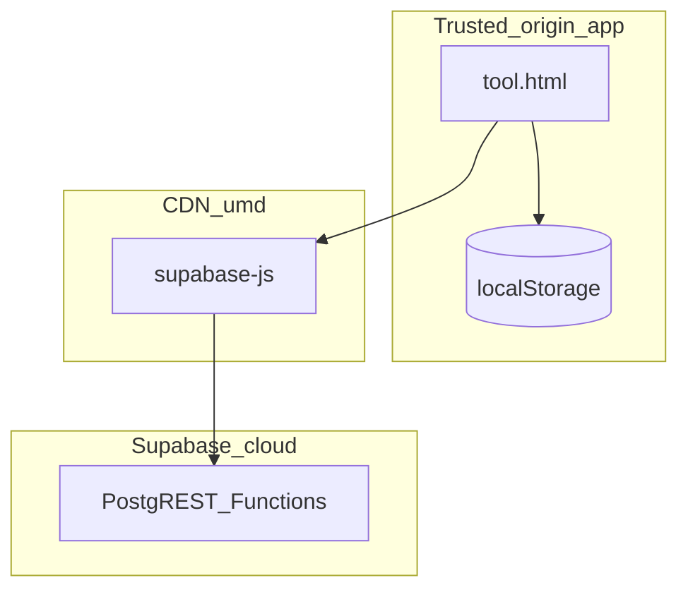

# Phase 2 — Runtime Security Report (Editor Focus)

**Target:** [`app/tool.html`](../../../app/tool.html), [`app/index.html`](../../../app/index.html) (iframe boundary)

---

## 1. Runtime threat model

**Assets:** User diagrams, JWT/session, clipboard contents, localStorage DB blob, AI credits.

**Threat actors:**

- Malicious diagram payload (import / cloud sync / compromised share JSON)
- Malicious browser extension injecting DOM
- Embedded hostile iframe messaging parent (`app/index.html`)
- Malicious project **name** returned from cloud

---

## 2. Attack surface matrix

| Surface | Severity | Confidence | Evidence | Exploit sketch |
|---------|----------|------------|----------|----------------|
| `nodesLayer` / `connectionsLayer` innerHTML wipe + rebuild | Medium | High | ~9994, ~10017 | Supply-chain focuses on **what strings** reach DOM |
| `renderProjects` HTML interpolation | **High** | High | ~9628 `el.innerHTML = \`<div>${p.name}</div>...\`` | Store XSS if project name contains `${p.name}</div><div class="muted">${p.nodes.length} nodes</div><div class="project-actions">...
```

| Finding | Severity | Confidence | Remediation |
|---------|----------|------------|-------------|
| Unescaped `${p.name}` | **Critical** | High | Use `textContent` nodes or `escapeHtml` |

**Reproduction:** Set project name to `<div class="node-icon">${preset.icon}</div><div class="preview-label">${preset.label}</div></div>`;
```

| Severity | Confidence | Notes |
|----------|------------|-------|
| Low | High | Data from local `FLOWCHART_MODE_PRESETS` constant — not user-supplied |

---

## 4. postMessage / iframe

Parent shell [`app/index.html`](../../../app/index.html):

```34:36:c:\mapdiagram\app\index.html
    try {
      fr.contentWindow.postMessage({ type: "mapdiagram-theme-sync", mode: m }, "*");
```

Editor **does not** register `window.addEventListener("message")` (Phase 2 grep) — theme crosses via shared `theme-engine` / events instead.

| Finding | Severity | Confidence | Phase 2 note |
|---------|----------|------------|--------------|
| Wildcard targetOrigin | High | High | Already flagged Phase 1 — persists |

---

## 5. Publish / share exposure

```12685:12713:c:\mapdiagram\app\tool.html
  async function publishFlowchart() {
    ...
      const snap = FlowchartProduct.buildSnapshot({ ... });
      const result = await FlowchartProduct.publishToSupabase(..., { title: snap.title, data: snap });
```

| Risk | Severity | Confidence |
|------|----------|------------|
| Oversized / sensitive fields in snapshot | Medium | Low — depends on `FlowchartProduct` implementation (**Not verified** source this phase) |
| Clipboard leaks URL | Low | Medium |

---

## 6. Import / malicious diagram

**Not verified:** `fileInput` import pipeline parsing — Phase 3 requires tracing JSON → `normalizeNode` / graph merge.

---

## 7. Console leakage

```5085:5092:c:\mapdiagram\app\tool.html
    console.info("[App Auth] Config loaded:", {
      urlOk: urlNorm.ok,
      ...
      anonKeyShape: ...
```

| Severity | Confidence |
|----------|------------|
| Medium | High — aids attacker fingerprinting |

---

## 8. Trust boundary diagram



---

## 9. Priority remediations

1. **Eliminate raw HTML interpolation** for project names (Critical).  
2. Audit **all** `innerHTML` assignments with user-derived strings (grep-backed Phase 3 checklist).  
3. Harden parent `postMessage` targetOrigin when hostname known.
