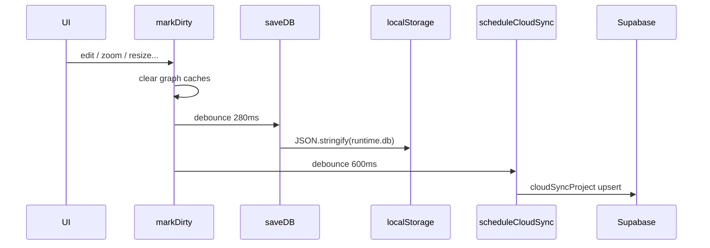

# Phase 2 — Save / Load / History Consistency Report

**Target:** [`app/tool.html`](../../../app/tool.html)

---

## 1. Save/load lifecycle map



**Evidence (`markDirty`):**

```5056:5076:c:\mapdiagram\app\tool.html
  function markDirty() {
    if (!runtime.readOnly) {
      runtime.fcEditCount = (runtime.fcEditCount || 0) + 1;
      try { localStorage.setItem(MD_EDIT_COUNT_KEY, String(runtime.fcEditCount)); } catch (_) {}
      ...
    }
    runtime.graphCache = null;
    runtime.graphCacheKey = "";
    runtime.groupBoxCache = null;
    runtime.groupBoxCacheProjectId = null;
    savedIndicator.textContent = "Saving...";
    if (runtime.autosaveTimer) clearTimeout(runtime.autosaveTimer);
    runtime.autosaveTimer = setTimeout(() => {
      getProject().updatedAt = Date.now();
      saveDB();
      scheduleCloudSync();
      scheduleSoftLockPrompt();
    }, 280);
  }
```

---

## 2. Undo/redo integrity

### Snapshot contents

```5496:5508:c:\mapdiagram\app\tool.html
  function pushHistory() {
    if (runtime.readOnly) return;
    const p = getProject();
    runtime.undo.push(deepCopy({
      nodes: p.nodes,
      connections: p.connections,
      userGroups: p.userGroups || [],
      groupConnections: p.groupConnections || [],
      flowGroups: deepCopy(p.flowGroups || []),
      view: p.view
    }));
    if (runtime.undo.length > 120) runtime.undo.shift();
    runtime.redo = [];
  }
```

### Restore path

```5517:5554:c:\mapdiagram\app\tool.html
  function restoreSnapshot(stackFrom, stackTo) {
    ...
    p.nodes = snap.nodes;
    p.connections = snap.connections;
    ...
    clearFcInteractionState();
    recomputeAllFlowGroupBounds();
    runtime.selectedNodeId = null;
    runtime.selectedNodeIds.clear();
    runtime.selectedConnectionId = null;
    ...
    renderAll();
    markDirty();
  }
```

| Integrity gap | Severity | Confidence | Evidence | Corruption scenario |
|---------------|----------|------------|----------|---------------------|
| **`runtime.connectionUi` not snapshotted** | **High** | High | Absent from pushHistory keys | Undo mid-custom-route edit leaves stale CP handles |
| **`runtime.selectedFlowGroupId` not reset** | **High** | High | No assignment in restoreSnapshot block | Undo removes group; selection id orphans → toolbar acts on ghost |
| **`runtime.semanticTypes` / suggestion caches** | Medium | Medium | Not in snapshot | Undo graph → stale semantic overlays until `analyzeDiagramSemantics` — **Not traced per undo path** |
| **Redo cleared on every push** | Low | High | ~5508 | Standard linear history — intentional |

---

## 3. Serialization boundary

| Layer | Format | Validator |
|-------|--------|-----------|
| Local DB | Single JSON blob `DB_KEY` | Try/catch → fallback shape ~5043–5046 |
| Cloud row `.data` | JSON embedded in Postgres | Implicit trust — server schema **Not verified** Phase 2 |
| Publish (`publishFlowchart`) | `FlowchartProduct.buildSnapshot` | Delegated to [`assets/flowchart-product.js`](../../../assets/flowchart-product.js) — **Not opened** |

---

## 4. Cloud ↔ local collision

```5380:5414:c:\mapdiagram\app\tool.html
  async function loadCloudProjects() {
    ...
    runtime.db.projects = (data || []).map((row) => ({
      projectId: row.id,
      ...
    }));
    ...
    saveDB();
    renderAll();
```

| Finding | Severity | Confidence | Runtime impact |
|---------|----------|------------|----------------|
| Logout path reloads **local** DB | Medium | High | ~5472–5476 `loadDB(); ensureBoot();` |
| Login replaces projects wholesale | **High** | High | Unsaved local changes risk if cloud sync lagging — **race Not verified** |

---

## 5. Project switch clears history

```9654:9661:c:\mapdiagram\app\tool.html
        runtime.db.activeProjectId = p.projectId;
        runtime.selectedNodeId = null;
        clearAllEdgeSelection();
        runtime.selectedNodeIds.clear();
        runtime.undo = [];
        runtime.redo = [];
        renderAll();
```

**UX coupling:** Users lose undo stack silently when switching projects from sidebar.

---

## 6. Data corruption risk table

| ID | Risk | Severity | Confidence | Mitigation |
|----|------|----------|------------|------------|
| D1 | Malformed `localStorage` JSON | Medium | High | Silent fallback ~5045 |
| D2 | Partial undo vs overlay state | High | High | Snapshot `connectionUi` + clear flow selection |
| D3 | Schema drift (`flowGroups` newer than loader) | Medium | Medium | `ensureFlowGroups` mitigates — verify edge cases Phase 3 |
| D4 | `deepCopy` loses prototypes | Low | High | Document |

---

## 7. Autosave determinism

| Behavior | Deterministic? |
|----------|----------------|
| Same graph → immediate byte-equal JSON | **No** — key order, timestamps |
| Functional equivalence after reload | **Mostly** — excludes transient runtime |

---

## 8. Required fixes (priority)

1. `restoreSnapshot`: `clearFlowGroupSelection()` + `runtime.connectionUi = {}` (or selective prune).  
2. Document / UX warn when switching projects destroys undo.  
3. Add integration test: undo after flow group delete restores consistent selection state.
