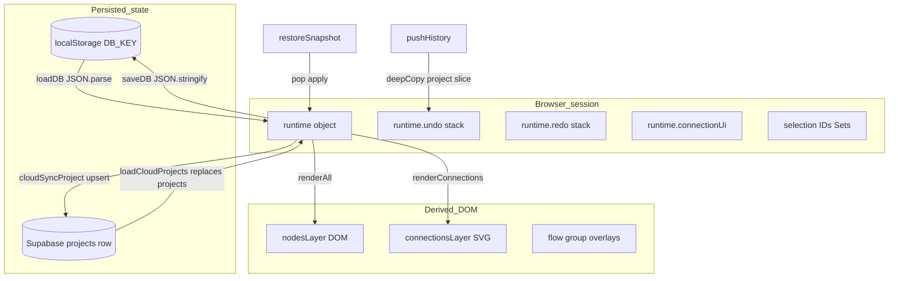

# Phase 2 — State Architecture Report

**Target:** [`app/tool.html`](../../../app/tool.html)  
**Phase 1 reference:** [`reports/audit/phase-1/MONOLITH_DISCOVERY_REPORT.md`](../../phase-1/MONOLITH_DISCOVERY_REPORT.md)

---

## 1. State flow map



---

## 2. State ownership table

| State bucket | Owner struct | Persisted in undo? | Persisted in localStorage? | Persisted in cloud payload? |
|--------------|--------------|-------------------|---------------------------|----------------------------|
| Nodes | `p.nodes` | Yes (~L5499–5505) | Via `runtime.db` (~L5049–5050) | Yes (~L5423–5430) |
| Connections | `p.connections` | Yes | Yes | Yes |
| User groups | `p.userGroups` | Yes | Yes | Yes |
| Group connections | `p.groupConnections` | Yes | Yes | Yes |
| Flow groups | `p.flowGroups` | Yes (`deepCopy`) | Yes | Yes |
| Viewport | `p.view` | Yes | Yes | Yes |
| Connection CP UI | `runtime.connectionUi` | **No** | **No** | **No** |
| Selection | `runtime.selectedNodeId`, Sets, flow group id | Partial | **No** | **No** |
| Undo/redo stacks | `runtime.undo`, `runtime.redo` | N/A | **No** | **No** |
| AI credits cache | `runtime.aiCredits` | No | No | No |
| Auth user | `runtime.authUser` | No | Supabase session (SDK) | N/A |

---

## 3. Global mutation hotspots

| Hotspot | Approx lines | Severity | Confidence | Evidence | Runtime impact |
|---------|--------------|----------|------------|----------|----------------|
| `runtime` literal | ~3993–4035+ | High | High | Single object aggregates 50+ fields | Any invariant violation affects unrelated subsystems |
| `markDirty` | ~5056–5076 | High | High | Clears graph caches + debounced autosave + cloud timer | Burst edits → merged save; still triggers cloud/network |
| `pushHistory` | ~5496–5509 | Medium | High | `deepCopy` full nodes/connections snapshot | Memory ~120 deep snapshots max; GC pressure |
| `restoreSnapshot` | ~5517–5554 | High | High | Mutates project + clears interaction | See integrity gaps below |
| `loadCloudProjects` | ~5380–5415 | **Critical** | High | **Replaces** `runtime.db.projects` array | Local-only edits can be overwritten if race with sync |
| `ResizeObserver` | ~4276–4280 | High | High | Calls `syncNodeSizes`, **`renderConnections`**, **`markDirty`** | Resize storms → repeated saves + full edge rebuild |

**Evidence (`ResizeObserver`):**

```4276:4280:c:\mapdiagram\app\tool.html
  const resizeObserver = new ResizeObserver(() => {
    syncNodeSizes();
    renderConnections();
    markDirty();
  });
```

---

## 4. Hidden coupling report

| Finding | Severity | Confidence | Lines | Evidence | Runtime impact |
|---------|----------|------------|-------|----------|----------------|
| `getProject()` ties **all** logic to `runtime.db.activeProjectId` | High | High | ~5480–5482 | `return runtime.db.projects.find(...)` | Switching project clears undo stacks (~L9658–9659) — surprising UX coupling |
| `renderAll()` orchestrates 10+ sub-renderers | High | High | ~12045–12063 | Single choke point | Any caller triggers **full** node + edge + semantic rebuild |
| Flowchart selection uses parallel IDs (`selectedFlowGroupId`) **not** cleared on undo | **High** | High | ~5517–5554 vs ~5908 | `restoreSnapshot` clears node/edge selection only | Stale group selection referencing removed `flowGroups` entries |
| `runtime.connectionUi` survives undo while connections replaced | **High** | High | ~5499 vs ~10017–10023 | History omits `connectionUi`; `renderConnections` prunes orphan keys but **mid-gesture** undo risky | Custom CP edits may reference deleted conn IDs inconsistously until full render |

---

## 5. Serialization risk report

| Risk | Severity | Confidence | Evidence | Remediation |
|------|----------|------------|----------|-------------|
| `deepCopy` via `JSON.parse(JSON.stringify)` | Medium | High | ~3991 | Loses `undefined`, non-JSON types, `Date` fidelity | Document schema; use structured clone where needed |
| `loadDB` fallback silent | Medium | High | ~5043–5046 | Parse failure → blank DB shape | Surface UI error |
| Cloud payload omits editor-only runtime fields | Low | High | ~5418–5431 | By design | Ensure publish snapshot builder (`FlowchartProduct.buildSnapshot`) stays in sync |
| Concurrent `scheduleCloudSync` vs user typing | Medium | Medium | ~5445–5452 debounce 600ms | Rapid auth toggle could overlap | AbortController / sync revision tokens (Phase 3) |

---

## 6. Determinism checks

| Question | Verdict | Confidence | Notes |
|----------|---------|------------|-------|
| Save/load deterministic byte-for-byte? | **No** | Medium | `updatedAt`, reordering from cloud, JSON key order |
| Reload restores identical editor state? | **Partial** | High | Restores diagram; **not** undo stacks, selection, `connectionUi`, ephemeral panels |
| Undo restores consistency? | **Partial** | High | **Fails** for `selectedFlowGroupId` stale pointer; `connectionUi` not versioned |
| Async corrupt state? | **Plausible** | Medium | `loadCloudProjects` replaces DB while timers pending — **Not verified** with concurrency test |

**Reproduction scenario (stale flow group selection):**

1. Select flowchart group A (`runtime.selectedFlowGroupId = A`).  
2. Perform edit that pushes history then undo via `restoreSnapshot`.  
3. Snapshot restores graph **without** clearing `selectedFlowGroupId` (no assignment in ~5517–5554).  
4. Toolbar / delete path may target wrong or missing group until next explicit selection.

---

## 7. Serialization boundary diagram

```
  User edit
    → mutate p.nodes / p.connections / ...
    → pushHistory() deepCopies {nodes, connections, userGroups, groupConnections, flowGroups, view}
    → markDirty() → debounced saveDB(JSON.stringify(runtime.db))
    → scheduleCloudSync() → cloudSyncProject({ data: { ... same fields }})

  Undo:
    → restoreSnapshot: overwrite project fields from stack
    → clearFcInteractionState()
    → DOES NOT snapshot/restore runtime.connectionUi / selectedFlowGroupId
```

---

## 8. Required remediation summary

1. **`restoreSnapshot`:** call `clearFlowGroupSelection()` or `runtime.selectedFlowGroupId = null` + toolbar sync.  
2. **`restoreSnapshot`:** reset `runtime.connectionUi = {}` or selectively prune after snapshot apply.  
3. **`ResizeObserver`:** debounce/batch `renderConnections` + avoid unconditional `markDirty` on trivial dimension churn.
