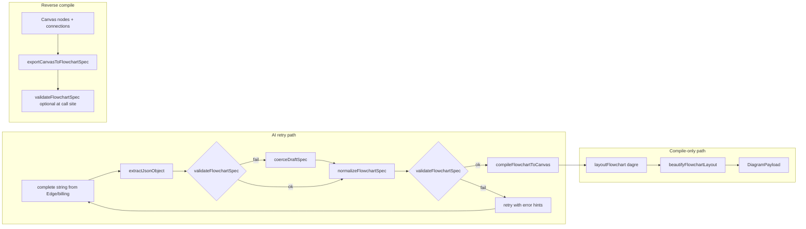

# Phase 3 — Flowchart Compiler Audit

**Scope:** `src/flowchart/**`, bundled `app/flowchart-compiler.js`, `tests/flowchart/**`, integration hooks in `app/tool.html` / `assets/flowchart-product.js`.

---

## Compiler Pipeline Diagram



---

## Graph Processing Flow

| Stage | Implementation | Notes |
|-------|----------------|-------|
| Parse AI text | `extractJsonObject` (`flowchart-spec.ts` ~339–347) | Fence strip + first `{…}` slice + `JSON.parse` |
| Draft repair | `coerceDraftSpec` (`flowchart-normalize.ts` ~172–213) | Permissive; infers `kind` from label heuristics |
| Normalize | `normalizeFlowchartSpec` (~218–248) | Mutating helpers (`autoMarkBackEdges`, orphan removal, dedupe labels) |
| Strict gate | `validateFlowchartSpec` (`flowchart-spec.ts` ~206–337) | Structural + graph invariants |
| Layout | `layoutFlowchart` (`flowchart-layout.ts` ~35–69) | Dagre on **forward** edges only |
| Polish | `beautifyFlowchartLayout` (`flowchart-beautify.ts`) | Deterministic snapping / sibling reorder |
| Emit canvas | `compileFlowchartToCanvas` (`flowchart-compile.ts` ~130–200) | Stable logical→canvas id mapping via `batchId` + slug |

---

## Validation Coverage Matrix

| Concern | Covered in `validateFlowchartSpec` | Gap / nuance |
|---------|-----------------------------------|--------------|
| Root shape | Yes | — |
| `version === 1` | Yes | No forward-compatible multi-version routing |
| Node caps | Yes (`FLOWCHART_LIMITS`) | Coercion path can shrink graph before validation |
| Duplicate ids | Yes | — |
| Edge endpoints exist | Yes | — |
| Self-loops | Yes | — |
| Single start / ≥1 end | Yes | `normalizeFlowchartSpec.ensureEndNode` can promote a leaf **without** full structural proof |
| Decision ≥2 outgoing | Yes (forward OR total outgoing ≥2) | Allows odd graphs if back-edges inflate count |
| Forward DAG | Yes (`hasCycle` on forward edges) | — |
| Back-edge budget | Yes (`maxBackEdges`) | — |
| Back-edge ancestor rule | Yes (`computeForwardRanks`) | Rank gaps if disconnected forward reachability |
| Complex SCC | Heuristic (~188–200) | May reject some valid patterns or accept edge cases — logic is bespoke |

---

## Failure Propagation Map

| Failure | Where surfaced | Consumer behavior |
|---------|----------------|-------------------|
| `extractJsonObject` throws | `compileFlowchartSpecWithRetries` catch (~47–50) | Retry with parse error string |
| Validation fails after normalize | Same (~55–61) | Retry with `lastErrors` injected into user prompt |
| All attempts exhausted | Throw (`flowchart-retry.ts` ~63–65) | `tool.html` must catch (Generate path); user sees failure |
| `compileFlowchartToCanvas` without prior validate | Non-null `idMap.get` (`flowchart-compile.ts` ~177–178) | **Runtime throw** if caller bypasses validation |

---

## Determinism Risk Report

| Risk | Severity | Confidence | Evidence | Impact |
|------|----------|------------|----------|--------|
| Topological `revealOrder` tie-break | Low | High | `topologicalOrder` uses `.sort()` on queue (`flowchart-compile.ts` ~114–124) | Stable given stable `spec.nodes` order |
| Layout + beautify | Low | High | Vitest asserts identical coords (`tests/flowchart/compiler.test.ts` ~249–279) | Reproducible builds |
| Connection `id`s | N/A (by design) | High | `newId()` from caller (`compileFlowchartToCanvas` ~176) | Payload not id-stable across runs unless `newId` is deterministic |
| Bundle vs source drift | Medium | High | `app/flowchart-compiler.js` is build output (`package.json` `build:flowchart`) | Stale bundle = different behavior than `src/flowchart` tests |

---

## Crash Scenario Matrix

| Scenario | Crashes compiler? | Confidence | Evidence |
|----------|-------------------|------------|----------|
| Malformed JSON in `extractJsonObject` | No (caught in retry loop) | High | `flowchart-retry.ts` ~45–50 |
| Valid JSON, invalid spec, unfixable by normalize | No (controlled throw after retries) | High | ~63–65 |
| **`compileFlowchartToCanvas` + edge to missing node id** | Yes (`!` on undefined) | High | `flowchart-compile.ts` ~177–178 |
| **Dagre internal error** (exotic graph) | **Not verified** | Low | No `try/catch` around `dagre.layout` (`flowchart-layout.ts` ~56) |
| Extremely deep BFS queues | Low practical risk | Medium | Bounded by `FLOWCHART_LIMITS.maxNodes` (25) |

---

## Compiler Trust Assumptions

1. **Callers always validate** before `compileFlowchartToCanvas` — enforcement is conventional, not typed.
2. **AI output** is untrusted until `validateFlowchartSpec` passes; `coerceDraftSpec` bridges invalid → draft and can hide root cause until final validation fails.
3. **`normalizeFlowchartSpec.autoMarkBackEdges`** (`flowchart-normalize.ts` ~145–158) may mark up to two edges as back-edges based on rank heuristics — trust that this matches author intent for all customer flows.
4. **Export round-trip**: `exportCanvasToFlowchartSpec` re-derives logical ids from labels (`flowchart-export-spec.ts` ~50–58) — collisions resolved with suffixes; semantic identity of nodes is **not** preserved 1:1 with original spec ids.

---

## Findings (evidence-backed)

### C-1 — `compileFlowchartToCanvas` assumes validated edge endpoints

- **Severity:** High (defensive coding)  
- **Confidence:** High  
- **File:** `src/flowchart/flowchart-compile.ts`  
- **Lines:** ~172–178  
- **Evidence:**

```typescript
  const connections: CanvasConnection[] = spec.edges.map((e) => {
    // ...
      from: idMap.get(e.from)!,
      to: idMap.get(e.to)!,
```

- **Impact:** Any code path that compiles without `validateFlowchartSpec` can throw; in production this aborts generation mid-apply.  
- **Failure scenario:** Internal refactor passes a hand-mutated `FlowchartSpec`.  
- **Remediation:** Assert / throw explicit error if `idMap` lacks `from`/`to` before map, or narrow type to “validated spec”.

### C-2 — `extractJsonObject` uses broad slice + `JSON.parse` (hostile inputs)

- **Severity:** Medium  
- **Confidence:** High  
- **File:** `src/flowchart/flowchart-spec.ts`  
- **Lines:** ~339–347  
- **Evidence:** First `{` to last `}` substring; megabyte strings can cause CPU/memory pressure before validation.  
- **Impact:** Edge function caps prompt size; standalone bundler misuse could still stress tab.  
- **Failure scenario:** Paste attack in dev tools calling compiler directly.  
- **Remediation:** Enforce max string length before parse; use streaming / stricter JSON extraction for untrusted channels.

### C-3 — Normalization can auto-mark back-edges (semantic shift)

- **Severity:** Medium  
- **Confidence:** High  
- **File:** `src/flowchart/flowchart-normalize.ts`  
- **Lines:** ~145–158  
- **Evidence:** Mutates `e.meta.isBackEdge` when `marked < 2` and rank suggests backward flow.  
- **Impact:** Downstream layout (dagre excludes back-edges) and `revealOrder` change; author-expected “forward” edge may become dashed back-edge.  
- **Failure scenario:** AI draws backward forward-edge without explicit meta; normalization “fixes” graph semantics unexpectedly.  
- **Remediation:** Log when auto-mark fires; optional feature flag; unit tests for ambiguous cases.

### C-4 — Build artifact coupling (`flowchart-compiler.js`)

- **Severity:** Medium  
- **Confidence:** High  
- **File:** `app/tool.html` ~7110–7121; `package.json` scripts  
- **Evidence:** Lazy-load `flowchart-compiler.js`; onerror instructs `npm run build:flowchart`.  
- **Impact:** CI/deploy that omits rebuild ships stale compiler vs passing tests on `src/flowchart`.  
- **Failure scenario:** TS fix merged; app still serves old bundle until someone runs build.  
- **Remediation:** CI gate: hash or test that built bundle matches `src` (or always build in release pipeline).

---

## Limitations (not verified)

- **Dagre** behavior on malformed / empty forward-edge sets with orphan nodes — requires property tests or fuzzing.  
- **Runtime** integration errors in `tool.html` merge path (`compileFromTemplateSpec`, `applyCanvasPayload`) — full trace needs browser debugging.

---

## Suggested instrumentation

- Compiler span: start/finish `compileFlowchartSpecWithRetries` + per-attempt latency.  
- Counter: `autoMarkBackEdges` mutations, `coerceDraftSpec` fallback rate.  
- Assertion build: `compileFlowchartToCanvas` validates preconditions in dev.
