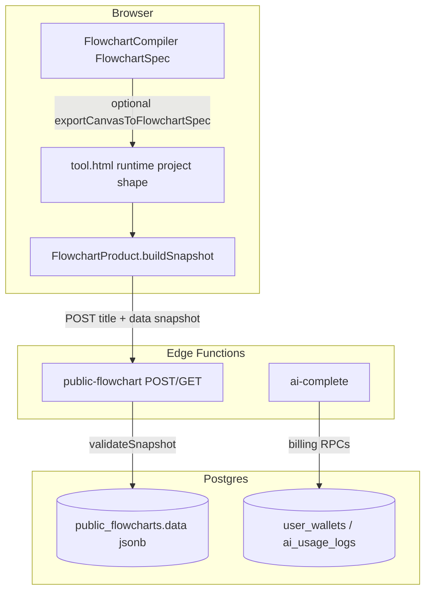

# Phase 3 — Data Contract Audit

Cross-boundary contracts among editor (`app/tool.html`), product layer (`assets/flowchart-product.js`), compiler (`src/flowchart`), Edge (`supabase/functions/public-flowchart`, `ai-complete`), and DB (`public_flowcharts`, billing tables).

---

## System Contract Map



---

## Payload Validation Matrix

| Boundary | Payload | Server/client validation | Formal schema |
|----------|---------|---------------------------|---------------|
| Editor → `public-flowchart` POST | `{ title?, data: { nodes[], connections[], … } }` | Size + array lengths only (`supabase/functions/public-flowchart/index.ts` ~64–77) | **None** (implicit TS-style checks) |
| `public-flowchart` GET → viewer | Row + `data` jsonb | Parent `view.html` checks `res.j.data` truthy | None |
| **`FlowchartSpec`** (AI/compiler) | version 1, nodes, edges | `validateFlowchartSpec` exhaustive | Inline types + tests |
| **Canvas snapshot** (publish) | nodes, connections, groups, view | Edge: node/edge **counts** only; **not** shape per node | Implicit editor schema |
| **`ai-complete`** | `{ system, user, model?, idempotencyKey? }` | Char limits + model allowlist (`ai-complete/index.ts` ~126–144) | Loose JSON |
| Stripe webhook | Stripe event JSON | Signature (non-mock); metadata presence (`stripe-webhook/index.ts`) | Stripe-defined |

---

## Schema Drift Risks

### DC-1 — Publish snapshot vs FlowchartSpec are different universes

- **Severity:** High  
- **Confidence:** High  
- **Files:** `assets/flowchart-product.js` ~37–49; `src/flowchart/flowchart-spec.ts`  
- **Lines:** snapshot includes `userGroups`, `groupConnections`, `view`, `diagramKind`; `FlowchartSpec` has none of these.  
- **Evidence:**

```javascript
    return {
      title: p.title || p.name || "Flowchart",
      nodes: hooks.deepCopy(p.nodes || []),
      connections: hooks.deepCopy(p.connections || []),
      userGroups: hooks.deepCopy(p.userGroups || []),
      groupConnections: hooks.deepCopy(p.groupConnections || []),
      view: hooks.deepCopy(p.view || { x: 0, y: 0, zoom: 1 }),
      diagramKind: "flowchart",
```

- **Impact:** Public share stores **full editor dialect**; consumers must tolerate unknown fields or evolution breaks viewers. Compiler validation never runs on publish payload.  
- **Failure scenario:** Editor adds mandatory field; old cached `sessionStorage` bootstrap omits it → subtle UI bugs.  
- **Remediation:** Version `diagramSnapshotVersion` in payload; shared Zod/JSON Schema for publish + viewer; strip or validate before insert.

### DC-2 — Quality score duplicated and divergent

- **Severity:** Medium  
- **Confidence:** High  
- **Files:** `supabase/functions/public-flowchart/index.ts` ~34–62; `src/flowchart/flowchart-quality.ts` ~33–85  
- **Evidence:** Edge `qualityScore` omits back-edge bonus and uses simpler label statistics than TS `qualityScoreFlowchart` (which adds `Math.min(15, backEdgeCount * 3)`).  
- **Impact:** Client-side preview of “indexable” can disagree with persisted `is_indexable` / `quality_score`. SEO/meta in `view.html` follows server values only.  
- **Failure scenario:** User sees “good” locally; published slug marked `noindex`.  
- **Remediation:** Single shared module (import from compiled bundle into Edge via vendoring or duplicate codegen with CI diff test).

### DC-3 — `bootstrapPublicView` trusts `sessionStorage` cache

- **Severity:** Medium  
- **Confidence:** High  
- **File:** `assets/flowchart-product.js` ~68–85  
- **Evidence:** Uses cached JSON without re-validating shape before `normalizeNode` / assignment.  
- **Impact:** Tampered sessionStorage (extension, XSS elsewhere) injects diagram structure into iframe editor.  
- **Failure scenario:** Defense-in-depth gap if another XSS exists.  
- **Remediation:** Always refetch GET for iframe or verify checksum/slug match; schema validate minimal fields.

### DC-4 — Billing reserve constant dual-sourced

- **Severity:** Medium  
- **Confidence:** High  
- **Files:** `src/ai-service.ts` ~6; `supabase/functions/ai-complete/index.ts` ~18–24  
- **Evidence:** Comments say must stay in sync; Edge uses `AI_RESERVE_CREDITS_PER_CALL` env override; client sends body but server computes reserve separately.  
- **Impact:** Misconfigured env vs client UX copy causes confusing “need X credits” messaging.  
- **Failure scenario:** Ops sets Edge to 50, product UI still says 18.  
- **Remediation:** Single config exported from build to Edge secrets template; startup self-check log.

### DC-5 — `exportCanvasToFlowchartSpec` loses stable ids

- **Severity:** Low (functional)  
- **Confidence:** High  
- **File:** `src/flowchart/flowchart-export-spec.ts` ~46–58  
- **Evidence:** New logical ids from slugified labels.  
- **Impact:** Round-trip AI refine may reorder ids; downstream diff/telemetry conflates nodes.  
- **Remediation:** Preserve optional `canvasId` → spec mapping extension field (versioned).

---

## Trust Boundary Violations

| Issue | Severity | Notes |
|-------|----------|-------|
| **`public_flowcharts.data`** writable only via service role on POST — OK; readable anonymously via Edge GET — stored payload is **trusted as viewer input** once rendered | High | Renderer must treat node text as text, not HTML (see Phase 2 XSS). |
| Templates fetched from `/templates/flowchart/*.json` | Medium | Integrity = same-origin trust + CSP; malicious deploy can alter templates. |

---

## Missing Validation Table

| Missing check | Location | Risk |
|---------------|----------|------|
| Per-node schema (required fields, types) | `validateSnapshot` | Malformed node objects stored; may throw in `normalizeNode` or render |
| Connection endpoint exists in `nodes[]` | Edge publish | Broken graphs in DB if editor bug bypasses |
| Max depth / recursion on groups | None at Edge | Oversized nested JSON within byte cap still possible |
| **`diagramKind`** enforcement | Edge | Non-flowchart payloads could be stored if editor mis-set |

---

## Contract formalism verdict

- **FlowchartSpec:** Strongest layer — validated, tested.  
- **Publish snapshot / public JSON:** Weakest — implicit editor shape, minimal Edge validation.  
- **Recommendation:** Introduce `PublishSnapshotV1` TypeScript interface + runtime validator shared between `FlowchartProduct.buildSnapshot`, Edge POST, and `bootstrapPublicView`.

---

## Limitations

- No runtime inspection of `normalizeNode` in `tool.html` (large file) — static assumption: it tolerates partial nodes.
