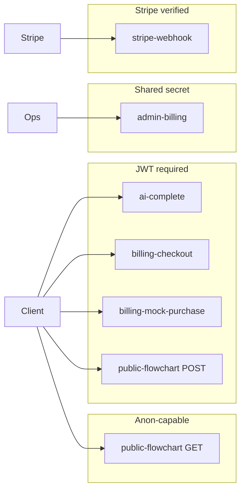

# Phase 3 — Supabase Edge Functions Audit

**Scope:** `supabase/functions/**` — `ai-complete`, `public-flowchart`, `billing-checkout`, `stripe-webhook`, `billing-mock-purchase`, `admin-billing`.

---

## Edge Function Topology

---

## Auth Boundary Map

| Function | Auth mechanism | Identity used |
|----------|----------------|---------------|
| `ai-complete` | `Authorization: Bearer` + `anon` client `getUser()` | `user.id` for RPC |
| `public-flowchart` POST | Same | `user_id` on insert |
| `public-flowchart` GET | **Optional** anon JWT pattern (`view.html` sends `Bearer anon`) | No user; slug lookup |
| `billing-checkout` | JWT | Embeds `user.id` in Stripe metadata |
| `billing-mock-purchase` | JWT + `ALLOW_MOCK_CREDIT_PURCHASES=1` | Credit grant |
| `admin-billing` | `x-admin-secret === ADMIN_BILLING_SECRET` | Full service role |
| `stripe-webhook` | Stripe signature (or `MOCK_STRIPE=1`) | Metadata `user_id` |

---

## Public Exposure Matrix

| Endpoint | Data exposed | Abuse vectors | Mitigations present |
|----------|--------------|-------------|---------------------|
| `GET public-flowchart?slug=` | Full published `data` jsonb | Scraping, enumeration | Slug has random suffix (`slugify` ~24–31); regex validation ~94–96 |
| Same | Increment `view_count` | Write amplification | Per-request update ~108–111 (no CAPTCHA — **cost/risk**) |
| CORS `*` | Any browser origin | CSRF not applicable to GET JSON; POST needs JWT | Acceptable for public API pattern |

---

## Request Validation Report

### EF-1 — `public-flowchart` POST accepts arbitrary node/connection objects

- **Severity:** High (integrity + XSS downstream)  
- **Confidence:** High  
- **File:** `supabase/functions/public-flowchart/index.ts`  
- **Lines:** ~64–77  
- **Evidence:** Only checks object root, `JSON.stringify` length, non-empty nodes, max counts.  
- **Impact:** Invalid structures persisted; relies entirely on viewer sanitization.  
- **Remediation:** Structural validator (reuse publish schema); reject unknown `diagramKind` if required.

### EF-2 — `public-flowchart` GET updates view_count without checking update error

- **Severity:** Low  
- **Confidence:** High  
- **Lines:** ~108–111  
- **Evidence:** Fire-and-forget `await admin.update(...)` — errors not handled.  
- **Impact:** Analytics skew; rare silent failure under RLS misconfig (service role bypasses RLS — low risk).  
- **Remediation:** Log error; optional debounced batch updates.

### EF-3 — `ai-complete` model allowlist

- **Severity:** Low (positive control)  
- **Confidence:** High  
- **File:** `supabase/functions/ai-complete/index.ts` ~34–40, ~126–131  
- **Impact:** Prevents arbitrary model billing surprises.

### EF-4 — Payload size limits on AI path

- **Severity:** Low  
- **Confidence:** High  
- **Lines:** ~137–144  
- **Impact:** Bounds token-ish abuse; aligns with operational limits.

---

## Failure Handling Gaps

### EF-5 — Stripe webhook: dual monetary hazards (`rpc_add_credits` + HTTP 200)

- **Severity:** Critical (financial integrity)  
- **Confidence:** High  
- **File:** `supabase/functions/stripe-webhook/index.ts`  
- **Lines:** `handleStripeEvent` ~99–111; outer handler ~58–63  
- **Evidence A:** On `rpc_add_credits` **error**, handler logs and **returns** without inserting `stripe_processed_events`. If Stripe **does** retry delivery for another reason, a later successful RPC could **double-grant** — no UNIQUE constraint on `reference_id` in `credit_transactions` (see base migration).  
- **Evidence B:** Outer handler **always responds HTTP 200** `{ received: true }` after `await handleStripeEvent(...)` **even when** credits failed inside — Stripe treats event as succeeded and typically **does not retry**, so the user may **never receive credits** after a transient DB fault.  
- **Remediation:** (1) Idempotent `rpc_add_credits` keyed by Stripe `session.id` / `event.id`; (2) record processed events only after successful grant **or** use transactional insert + RPC in one DB transaction; (3) return **non-2xx** when monetary mutation fails so Stripe retries (paired with idempotency).

### EF-6 — `stripe-webhook` mock mode parses arbitrary JSON as event

- **Severity:** High (staging only)  
- **Confidence:** High  
- **Lines:** ~26–34  
- **Evidence:** `MOCK_STRIPE=1` skips signature.  
- **Impact:** Mis-deployed mock in prod → forged credits path if reachable.  
- **Remediation:** Hard-disable mock when `SUPABASE_URL` matches prod project; separate mock function.

---

## Payment / Billing Risk Findings

| Finding | Severity | Evidence |
|---------|----------|----------|
| Checkout trusts JWT only | Low | `billing-checkout/index.ts` ~40–51 |
| Credits amount from server-side `PACKS` | Low | ~53–60 — client only selects pack **key** |
| Mock purchases gated by env | Medium | `billing-mock-purchase` ~16–21 |
| AI billing finalize retries | Low | `finalizeSuccessWithRetries` ~50–69 |

---

## Edge Runtime Constraints

- Dynamic imports from `esm.sh` (`stripe`, `@supabase/supabase-js`) — cold start + supply-chain trust in Deno deployer cache.  
- `ai-complete` OpenAI response parsed with `JSON.parse` (~251) inside try — failures refund path (~267–274).  
- **Idempotency:** AI path handles reused keys (~151–212); Stripe path weaker (see EF-5).

---

## Secrets Handling (static review)

- Service role keys only in Edge env — OK.  
- `admin-billing` relies on single header — **rotate secret** practice; no rate limit (abuse if leaked).  

---

## Limitations / not verified

- Live Supabase JWT validation behavior for expired tokens.  
- Actual RLS on `public_flowcharts` under `authenticated` policies in production — migration shows owner + anon read; Edge uses **service role** (bypasses RLS) — intentional.

---

## Recommended hardening order

1. Fix Stripe webhook idempotency (EF-5).  
2. Add publish payload schema validation (EF-1).  
3. Lock or isolate `MOCK_STRIPE` (EF-6).  
4. Unify quality scoring with TS (see `DATA_CONTRACT_AUDIT.md`).
