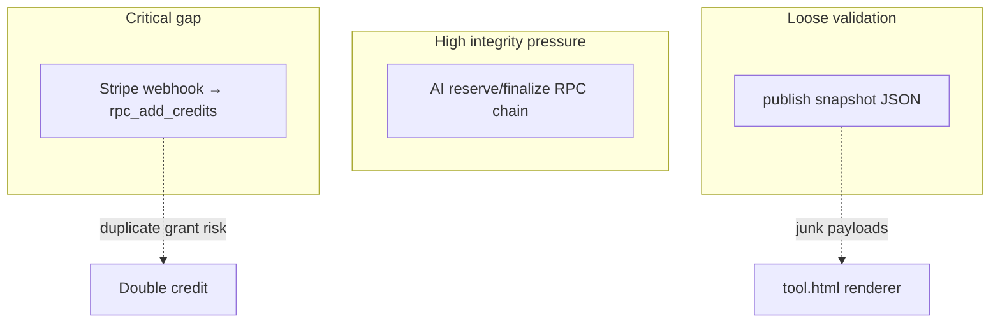

# Phase 3 — Failure & Resilience Audit

System-wide behavior when components misbehave or payloads are hostile.

---

## Failure Scenario Matrix

| Scenario | Detected? | Recovery behavior | Gap |
|----------|-----------|-------------------|-----|
| Compiler validation exhausts retries | Yes (`compileFlowchartSpecWithRetries` throw) | Error bubbles to UI | Needs user-visible error taxonomy |
| **`compileFlowchartToCanvas` on invalid spec** | Crash | Uncaught unless caller wraps | Missing defensive guard (`COMPILER_AUDIT_REPORT.md` C-1) |
| AI Edge OpenAI 5xx | Yes | `rpc_ai_finalize_failure` refunds reserve (`ai-complete/index.ts` ~239–247) | Good |
| AI finalize RPC exhaustion | Yes | Refund path (~267–274) | User sees 503 — credits safe |
| **`Stripe webhook rpc_add_credits` fails** | Logged only | No `stripe_processed_events` row → **retry risk** | **Critical gap** (`EDGE_FUNCTIONS_AUDIT.md` EF-5) |
| Publish POST 4xx | Yes (`publishToSupabase` throws) | Toast (`tool.html` ~12720–12721) | Partial — no structured retry |
| Publish POST network drop | Fetch rejection | User sees generic failure | No idempotent client-side retry key |
| **`public-flowchart` GET miss** | `view.html` catch | Error UI (~181–184) | OK |
| Public iframe bootstrap cache corrupt | Partial | Falls through to fetch (`flowchart-product.js` ~77–84) | Tampering still possible if parse succeeds |
| Malformed diagram JSON in DB | **Weak** | Depends on renderer | Silent render glitches / thrown normalize |
| Concurrent editor + cloud sync | Phase 2 flagged | Not re-proven here | Needs harness |
| Invalid slug enumeration | Regex 400 | Low sensitivity | OK |

---

## Recovery Capability Table

| Subsystem | Rollback | Partial completion | Idempotency |
|-----------|----------|---------------------|-------------|
| AI billing | Refund on failure | Reserve held until finalize | Strong (`user_id`, idempotency key) |
| Stripe credits | None automated | Half-applied webhook | **Weak** |
| Publish snapshot | Immutable new slug each POST | Duplicate publishes accumulate rows | No dedupe key |
| Local editor autosave | Local undo / reload | Possible corrupt localStorage | App-specific (`tool.html`) |

---

## Data Integrity Risk Map

---

## Partial Failure Handling Report

### FR-1 — View count update races

- **Severity:** Low  
- **Confidence:** Medium  
- **File:** `supabase/functions/public-flowchart/index.ts` ~108–111  
- **Evidence:** Read row → compute `view_count + 1` → update — classic lost-update under concurrency.  
- **Impact:** Under-count or last-write-wins skew — not monetary.  
- **Remediation:** `update ... set view_count = view_count + 1 returning ...` atomic increment.

### FR-2 — Session cache vs authoritative snapshot

- **Severity:** Medium  
- **Confidence:** High  
- **Files:** `view.html` ~177–178; `flowchart-product.js` ~68–76  
- **Evidence:** Parent caches JSON; iframe reads cache first.  
- **Impact:** Stale diagram until cache cleared if slug updated server-side (immutable slug reduces chance).  
- **Remediation:** TTL or version query param.

### FR-3 — Insufficient credits after optimistic UI

- **Severity:** Low  
- **Confidence:** Medium  
- **`ai-complete`** pre-check (~159–167) vs RPC truth — race allows brief stale “can afford” UX — resolved by 402 from RPC.

---

## Async Collision Matrix (editor × backend)

| Collision | Harm | Verified? |
|-----------|------|-------------|
| Double-click Publish | Duplicate `public_flowcharts` rows | **Not verified** — no UI disable beyond class `publishing` |
| Retry AI same idempotency key | 409 `idempotency_replay` (`ai-complete` ~204–210) | By code inspection |
| Cloud load replaces DB while typing | Local loss | Phase 2 hypothesis |

---

## System Resilience Scorecard

| Dimension | Score (1–5) | Rationale |
|-----------|-------------|-----------|
| Monetary correctness | **3** | Strong AI path; Stripe webhook weakness |
| Payload robustness | **2** | Publish + import paths permissive |
| Observability | **2** | Console logs scattered; no trace IDs |
| Multi-layer validation | **3** | Strong FlowchartSpec; weak publish |
| Operational rollback | **2** | Immutable publishes; manual cleanup |

*(Scores are qualitative engineering judgment from static audit.)*

---

## Limitations

- No chaos/load testing performed.  
- `tool.html` autosave error paths not exhaustively traced.
