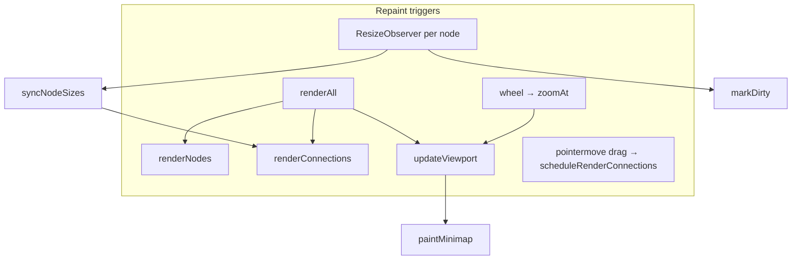

# Phase 4 — Rendering Performance Audit

**Primary:** `app/tool.html` — viewport transform, node layer, SVG edge layer, minimap, observers.

---

## Rendering Cost Map



**Dominant costs:**

| Stage | Mechanism | Growth |
|-------|-----------|--------|
| Full node redraw | `nodesLayer.innerHTML = ""` + recreate every `.node` (`renderNodes`) | O(N) DOM teardown/build |
| Full edge redraw | `connectionsLayer.innerHTML = ""` + SVG paths per edge (`renderConnections`) | O(E × N) obstacle lists per edge (see below) |
| Viewport pan/zoom | CSS `transform` on `#viewport` (`updateViewport`) | O(1) compositor-friendly |
| Minimap | Canvas fill + iterate nodes/groups (`paintMinimap`) | O(N + G) **per `updateViewport` when minimap visible** (~12067 early exit) |

---

## Frame Drop Risk Matrix

| Hot path | Severity | Confidence | When dangerous | Evidence |
|----------|----------|------------|----------------|----------|
| **`renderConnections` obstacle build × edges** | **Critical** | High | Medium graphs (50–150 nodes) with tens–hundreds of edges, orthogonal routing | Each edge allocates `obstacles` by scanning **all** other nodes (~10303–10309, ~10068–10074, repeated per bridge kind) |
| **`ResizeObserver` → sync + full edges + autosave pipeline** | **High** | High | Text wraps / font load / inspector resizes node bodies | ~4276–4279: `syncNodeSizes(); renderConnections(); markDirty();` — **no RAF batching** vs drag path |
| **Wheel zoom → `updateViewport` → `paintMinimap`** | **Medium–High** | High | **Only if minimap visible** (`paintMinimap` returns early otherwise ~12067); then trackpad inertia = many canvas fills/sec | ~12146–12158; ~9589–9597; ~12066–12067 |
| **Document-level `pointermove`** | **Medium–High** | High | Dragging multi-node selection with large N | ~13925–14018: per-move `querySelector` per dragged id (~14007–14011), `scheduleRenderConnections` (RAF-coalesced), semantic overlay scheduling |
| **`renderAll` fan-out** | **Medium** | High | Any caller invoking full pipeline unnecessarily | ~12045–12054 runs nodes + connections + overlays + semantic + suggestions + minimap |
| **`path.getTotalLength` during edge paint** | **Medium** | Medium | Many edges with enter animation (`fcConnEnterIds`) | ~10371–10376 forces layout metrics on SVG |

---

## DOM Mutation Hotspots

| Location | Lines ~ | Behavior | Impact |
|----------|---------|----------|--------|
| `renderNodes` | 9992–10013 | Clears entire `nodesLayer`, `appendChild` per node | Drops all listeners/observers targets; **recreates** subtree |
| `createNodeElement` → `resizeObserver.observe(el)` | 9988 | Each physical node registers observer | Resize churn scales with N |
| `renderConnections` | 10017–10051 | Clears SVG layer; rebuilds defs/markers | GC pressure + listener churn on hit paths |
| `renderProjects` / lists | 9624+, 10873+, etc. | `innerHTML` list clears | Sidebar churn on frequent `renderAll` |

---

## Layout Thrashing / Forced Sync Layout Findings

### LT-1 — `syncNodeSizes` reads layout for every node

- **Severity:** High  
- **Confidence:** High  
- **Lines:** ~12036–12042  

```javascript
  function syncNodeSizes() {
    for (const el of nodesLayer.querySelectorAll(".node")) {
      const n = getNodeById(el.dataset.nodeId);
      if (!n) continue;
      n.width = el.offsetWidth;
      n.height = el.offsetHeight;
    }
  }
```

- **Runtime impact:** `offsetWidth`/`offsetHeight` force layout when preceded by DOM writes in same tick elsewhere. Invoked from **`ResizeObserver`** callback (~4277), which fires during browser layout passes — compounds reflow cost.  
- **User-visible symptom:** Janky resize while editing long labels; dropped frames when multiple nodes wrap.  
- **Scalability:** O(N) layout reads per resize burst.

### LT-2 — `zoomAt` / pan read workspace rect frequently

- **Severity:** Medium  
- **Confidence:** High  
- **Lines:** ~12151 (`getBoundingClientRect`); pointer pan ~14021–14024 updates transform without extra rect reads — OK.

---

## Repaint Trigger Map

| Trigger | Calls | Batching |
|---------|-------|----------|
| Drag node | `scheduleRenderConnections` (~5745–5751) | ✅ RAF dedupe |
| ResizeObserver | Direct `renderConnections()` (~4278) | ❌ Immediate full SVG rebuild |
| Wheel zoom | `updateViewport` (~12157) | Each event reaches `paintMinimap` (~9597); **canvas work only if minimap visible** (~12067) |
| Undo `restoreSnapshot` | `renderAll` (~5552) | Full pipeline |

---

## Large Diagram Stress Risks

### LG-1 — Algorithmic coupling **E × N** inside `renderConnections`

For **each** connection of kinds that use obstacle avoidance, code builds:

```javascript
const obstacles = p.nodes
  .filter((n) => n.id !== fromNode.id && n.id !== toNode.id)
  ...
```

(~10303–10309 for node–node; similar blocks ~10068+, ~10115+, etc.)

`orthogonalPath` then does up to 5 tries × `obstacles.some × segments` (~9238–9258).

- **Operational threshold:** Rough **critical zone above ~80–120 nodes with ~150–400 edges** on mid laptops — **not benchmarked**; conservative estimate from nested loops + SVG DOM creation per edge.  
- **Symptom:** Editor feels “frozen” on pan/zoom or property change firing `renderAll`.  
- **Remediation:** Spatial hash / viewport culling for obstacles; incremental SVG updates; Web Worker geometry (heavy refactor).

---

## Estimated FPS Degradation (conservative, **Not verified**)

| Profile | Expected outcome |
|---------|------------------|
| **≤40 nodes, ≤60 edges**, minimap off | Generally fluid pan/zoom (GPU transform) |
| Same + minimap on | Wheel bursts may dip below 60 FPS due to canvas repaint |
| **100+ nodes**, dense edges, orthogonal | Single `renderConnections` can exceed **16 ms** — systematic frame drops |
| ResizeObserver storms (bulk label edit) | Sync layout + full rerender — multi-frame stalls |

---

## Suggested remediation (prioritized)

1. Debounce **`ResizeObserver`** callback: RAF-coalesce `syncNodeSizes` + `scheduleRenderConnections`; drop `markDirty` unless geometry stabilized >50 ms.  
2. **`paintMinimap`**: when minimap **is** visible, throttle to RAF during rapid zoom/pan — `updateViewport` invokes it every time (~9597) which can amplify wheel bursts.  
3. Precompute **obstacle spatial index** once per render pass, reuse per edge.  
4. Split **`renderConnections`** into dirty-edge incremental updates (high effort).

---

## Limitations

No Chrome Performance profiling traces captured — thresholds are **engineering estimates**. Recommended instrumentation: `performance.measure` around `renderConnections`/`renderNodes`, FPS meter overlay in staging.
