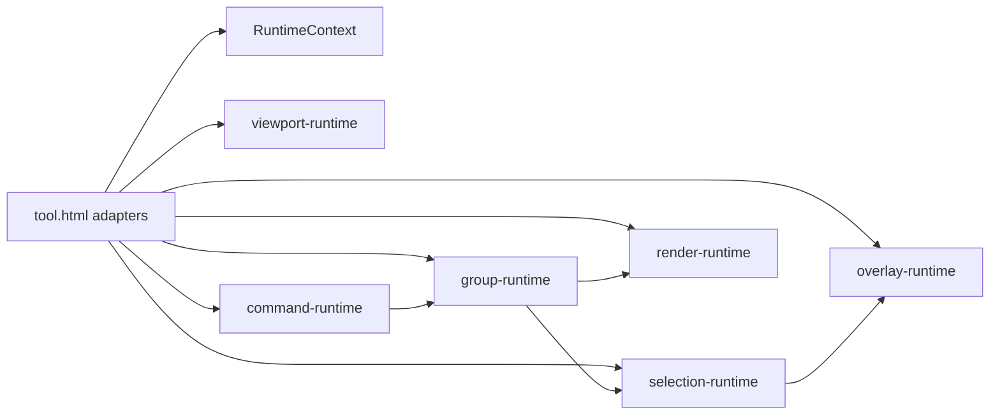

# Runtime Dependency Analysis

## Central fan-out

`renderAll` remains in `tool.html` and is the primary visual sync. Extracted modules must **not** call `renderAll` directly except via injected `scheduleFullRender` / `ctx.emit('selectionChanged')` adapters.

## High-risk couplings (documented)

| Zone | Coupling | Mitigation in Phase 6 |
|------|----------|------------------------|
| `restoreSnapshot` | Clears selection, tears down modal, invalidates caches | `selectionRuntime.clearAllForUndo()`, `teardownFocusModalUi()` via overlay adapter |
| `sanitizeSelectionState` | Clears stale ids + orphan modal guard | `selectionRuntime.sanitizeSelection()` → `syncFocusModalOrphanGuard` |
| `openFocusModal` | Sets `focusNodeId`, inspector population | `overlayRuntime` only; selection unchanged |
| `duplicateUserGroup` | History, selection, caches, integrity | `commandRuntime.executeCommand('duplicateGroup')` + `groupRuntime` |
| Undo stack | `pushHistory` / `restoreSnapshot` | Command runtime delegates `pushHistory`; no stack replacement |

## Module dependency graph

## Init order (`initMapDiagramRuntimes`)

1. `createRuntimeContext`
2. `createRenderRuntime`
3. `createOverlayRuntime`
4. `createSelectionRuntime` (uses overlay orphan guard)
5. `createViewportRuntime`
6. `createGroupRuntime` (selection + render deps)
7. `createCommandRuntime` + register `duplicateGroup`
